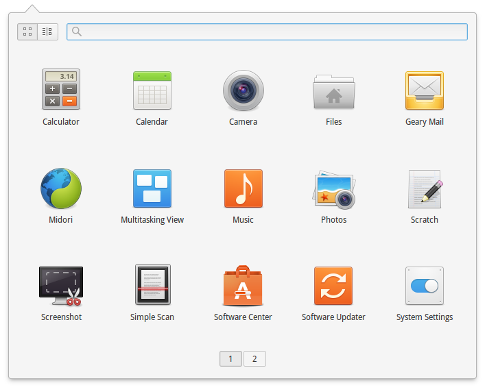
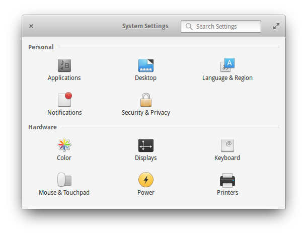

# Learning the Basics {#learning-the-basics}

As with every operating system there are some things that you may not be familiar with. This section will deal with how to complete simple, every day tasks such as browsing the web and listening to music, as well as other useful information that you may be unaware of.

## The Desktop {#the-desktop}

The elementary OS desktop is very simple and easy to learn. It consists of two elements: the panel and the dock. You can customize the desktop's wallpaper through **[System Settings](/docs/learning-the-basics#system-settings)** → **Desktop** → **Wallpaper**.

### The Panel {#the-panel}

At the top of the desktop is the Panel. On the left is the Applications Menu, in the center are the date and time, and on the right are the Indicators.

#### Applications Menu {#applications}

On the left side of the panel is the Applications Menu. Selecting **Applications** opens the menu with all of your installed apps. You can view multiple pages of apps using the pagers at the bottom or by scrolling. You can also use the view switcher at the top to switch between a grid view and a category view.

You can search for apps by name or by keyword and perform actions associated with them. You can also search for System Settings panes. Some of the actions you can find in search include:

* Shut Down and Restart
* Compose Message
* New Private Browsing Window
* Math operations (example: 23 * 5)

To open the Applications Menu with the keyboard, press <kbd>⌘</kbd> + <kbd>Space</kbd>.

#### Indicators {#indicators}

On the right side of the panel are icons called Indicators. These tell you of the current status of your session and device, i.e. network connections, battery, sound input and output, notifications, etc. Selecting an indicator exposes more information and related actions.

A middle click or three finger tap on an indicator will present you with the following quick actions:

* Sound: Toggle mute for the current output
* Bluetooth: Toggle Bluetooth on or off
* Power: Hide/show the percentage of battery remaining
* Notifications: Toggle Do Not Disturb mode
* Session: Show the Shut Down dialog

### The Dock {#the-dock}

At the bottom of the desktop is the Dock. It contains your favorite apps well as any apps that are currently open.

The contents of the dock are easily customizable. To add an app to the dock, drag and drop it from the Applications Menu or right-click an open app's icon and choose **Keep in Dock**. To remove an app from the dock, drag it off and drop it in an empty space on your desktop or right-click the icon and uncheck **Keep in Dock**. To rearrange apps on the dock, simply drag and drop them.

By default, the dock hides off the bottom of the desktop when an app is maximized. Simply move your mouse to the bottom center of the desktop to reveal the dock.

You can customize the dock's behavior through **[System Settings](/docs/learning-the-basics#system-settings)** → **Desktop** → **Dock**.

## App Windows {#app-windows}

Apps exist in their own windows which can be closed, maximized, or moved around.

When you open an app, its window appears on the desktop. Each app typically has three areas: the window buttons, a toolbar, and the contents of the app.

### Header Bar {#headerbar}

Many apps have a Header Bar at the top of the app. This area contains common actions or navigation items for the app, plus the Window Buttons.

You can move an app's window around the desktop by dragging anywhere on the Header Bar, including on buttons.

    

#### Window Buttons {#window-buttons}

An app's Window Buttons are at the top corners of the app window. The close button is on the left and the maximize button is on the right. Pressing the close button will close the app's window. Pressing the maximize button will toggle whether the app window takes up the full desktop or not. You can also drag a window to the top of the desktop or double-click its header bar to maximize, and drag from the top or double-click the header bar to unmaximize.

## Multitasking {#multitasking}

elementary OS supports two types of multitasking: windows and workspaces.

### Windows {#windows}

Apps open in app windows. They can overlap on your desktop and be moved around. You can switch between windows several ways:

* click on the window you want to switch to
* click on the app's icon in the dock
* press <kbd>Alt</kbd> + <kbd>Tab</kbd>
* To see an overview of your open app windows, press <kbd>⌘</kbd> + <kbd>S</kbd>.

You can customize these shortcuts through **[System Settings](/docs/learning-the-basics#system-settings)** → **Keyboard** → **Shortcuts** → **Windows**.

### Hot Corners {#hot-corners}

You can also configure "hot corners" (shortcuts activated by placing your cursor in the corner of the display) to activate multitasking functions like the window overview, workspace overview, and more.

You can customize hot corners through **[System Settings](/docs/learning-the-basics#system-settings)** → **Desktop** → **Hot Corners**.

### Workspaces {#workspaces}

By default, all app windows open on one workspace. However, you can use multiple workspaces to organize your workflow:

* To see an overview of your workspaces, press <kbd>⌘</kbd> + <kbd>S</kbd>
* To quickly move left or right through your workspaces, press <kbd>⌘</kbd> + <kbd>←</kbd> or <kbd>⌘</kbd> + <kbd>→</kbd>
* To cycle through your workspaces, press <kbd>⌘</kbd> + <kbd>Tab</kbd>
* You can jump straight to a specific workspace by pressing <kbd>⌘</kbd> + <kbd>1</kbd> through <kbd>⌘</kbd> + <kbd>9</kbd>. You can always jump to a new workspace with <kbd>⌘</kbd> + <kbd>0</kbd>.
* You can also drag app windows between workspaces by dragging their icons in the workspace overview, or move them left and right between workspaces using <kbd>⌘</kbd> + <kbd>Alt</kbd> + <kbd>←</kbd> or <kbd>→</kbd> respectively. To see an overview of app windows across all workspaces, press <kbd>⌘</kbd> + <kbd>A</kbd>.

You can customize these shortcuts through **[System Settings](/docs/learning-the-basics#system-settings)** → **Keyboard** → **Shortcuts** → **Workspaces**.

Some windows may also fullscreen onto a new workspace. You can move between workspaces as usual, and closing or un-fullscreening the app will return you to the previous workspace.

_Note: <kbd>⌘</kbd> refers to the "super" key. It is also known as the "Windows" key on most PCs or the "Command" key on Macs._

### Multiple Displays {#multiple-displays}

The panel, dock, and workspaces appear only on the primary display. Any other attached displays act as standalone workspaces. To manage and rearrange displays, head to **[System Settings](/docs/learning-the-basics#system-settings)** → **Displays**. Your primary display is marked with a filled-in star (<i class="fa fa-star"></i>) and each display's settings can be changed from its cog (<i class="fa fa-cog"></i>) menu.

## Installing Apps {#installing-apps}

elementary OS comes with **AppCenter**, an app store for open source pay-what-you want apps. Installing a new app from AppCenter is easy:

1. Open the **AppCenter** app.
2. Search in the top-right, or browse by category.
3. Select **Free** or the suggested price next to the app you want to install. To choose a different price, select the **▾** button and select or enter your own price.

You may be asked for your password prior to installing an app.

_Note: Some software may not be available from AppCenter. As of elementary OS 5.1 Hera, you can also sideload Flatpak apps from third-party .flatpakref files._

## Updating {#updating}

AppCenter includes updates for apps and the operating system itself under the **Installed** tab. Remember to install updates frequently to get the latest features, fixes, and security improvements. For more information related to security patches, read the [Ubuntu security notices](https://usn.ubuntu.com/).

## System Settings {#system-settings}

elementary OS comes with the "System Settings" app that lets you manage settings and preferences for your device. System Settings gives you the ability to adjust things like keyboard shortcuts, display resolution, your wallpaper, and more.

### Search {#search}

You can quickly find settings you are looking for by typing keywords in the search bar at the top of the window. The contents of the System Settings window will filter down to match your search.

### App Settings {#app-settings}

Keep in mind that System Settings only deals with the global preferences for elementary OS. Although some apps may also have their own preferences, you will not find them here. Instead, look for them inside the app in question.
